# Microservicios

## Implementación Netflix Stack

En los primeros pasos explicamos la arquitectura a alto nivel para tener una idea de como funciona. 

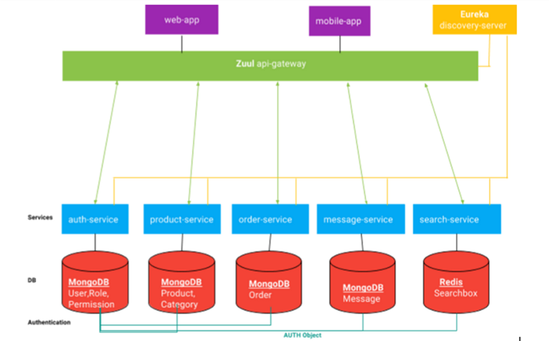

### Core Services

Acorde a una arquitectura microservicios dividimos la aplicación en servicios separados. Cada servicio es escalable e 
independiente con un ambito bien definido. Estos son construidos como proyectos SpringBoot:

- **auth-service** responsable de la gestión del proceso de autenticación utilizando una base de datos Mongo con usuarios
roles y permisos.
- **product-service** responsable del almacenamiento de los productos y gestión de inventario.

Los servicios con los que funciona la arquitectura Netflix son los siguientes:

- **discovery-server** es quien descubre los servicios que requerimos, cuando algun servicio necesita acceso a otro
servicio, discover server provee los detalles de los end points *Instance-Id = {Server-Host} + ':' {Service-Id} + ':' + {Server-Port})* 
Por otro lado discovery server no conoce nada mas sobre el servicio. Hay varias implementaciones para crear un discovery server 
(Netflix Eurea, Consul, Zookeeper) la arquitectura netflix utiliza Eureka.

Los clientes del discovery server son los discovery client cada uno esta etiquetado con *@EnableDiscoveryClient* o 
*@EnableEurekaClient*. En la configuración de cada uno de los clientes se utiliza la *defaultZone* para definir
la localización del discovery server. Con *leaseRenewallIntervalInSeconds* se puede configurar el tiempo de regisro.
El tiempo de registro toma mas de 30 segundos que es el tiempo de refresco por defecto.

*Balanceador de carga* Eureka provee los endpoints para las peticiones, pero es el balanceador de carga quien decide
a que endpoint establece la conexión. Según el agoritmo del balanceador de carga *Cliend-Side-Load-Balancer*  puede 
seleccionar el mejor endpoint de la lista para establecer la conexión. En nuestro caso se utiliza *Netflix Ribbon*
como balanceador de carga.

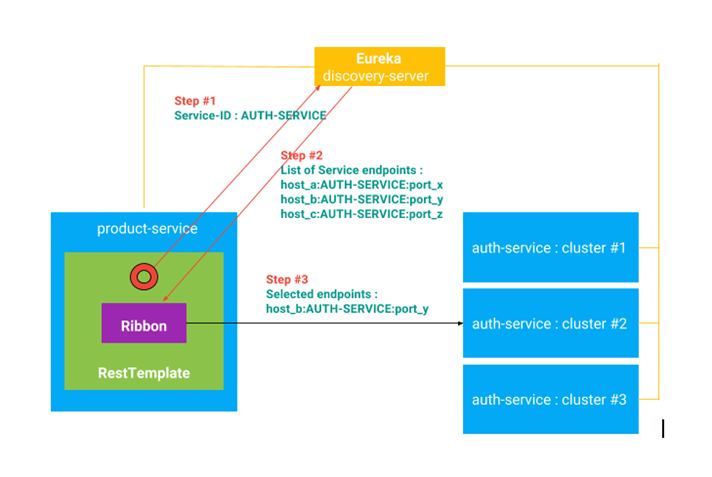

Dedendiendo de nuestras necesidades podremos cambiar al mejor algoritmo de balanceo de carga. En Ribbon hay varias
implementaciones: Simple Round Robin LB, Weighted Response Time LB, Zone Aware, Round Robin LB, Random LB.
Incluso se puede implementar un propio LB por defecto se utiliza Simple Round Robin.

En las clases de configuración AppConfiguration, se configuran los bean de acceso RestTemplate dentro del contexto
Spring. La anotación *@LoadBalancer * ayuda a configurar Ribbon dentro del RestTemplate.

```
	@LoadBalanced
	@Bean
	public RestTemplate restTemplate() {
		return new RestTemplate();
	}
```

RestTemplate para acceso al servicio de configuración implementado en CommonAuthenticationTokenFilter.java

```
ResponseEntity<String> responseEntity = restTemplate.exchange(
						"http://auth-service/auth/current"
						, HttpMethod.POST
						, entity
						, String.class);
```

- **api-gateway** Es la puerta de entrada al sistema indica como los usuarios externos como aplicaciones
móviles o web tienen acceso a nuestro servicio o en otras palabras expone los servicios a usuarios externos.

Aquí se utiliza dentro de la arquitectura Netflix el Zuul API Gateway (Zuul es el guardián de la puerta de GhostBusters)

Zuul se puede utilizar como un proxy y un filtro de peticiones.

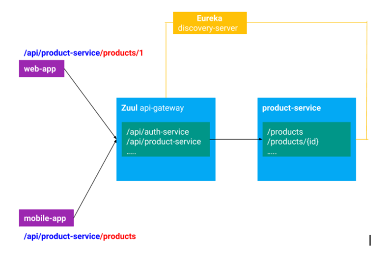

*Gestión de la seguridad* para esto principalmente se utiliza JWT (JSON Web Token) y Spring Security:


En las configuraciones de JWT para los servicios se encuentra esta entrada:
```
# Auth JWT
jwt:
  header: Authorization
  secret: secret_secret
  expiration: 172800 #seconds
  route:
    authentication:
      path: auth-service
      refresh: refresh
```
La aplicación de esto para la creación del token es la siguiente:
```
header = {"alg": "HS256", "typ": "JWT"}
payload = {
              "exp": "2017-08-09 12:00:00",
              "user_name": "user",
              "authorities": [
                   "ROLE_SELLER"
               ],
               ...
              }
secret_key = "secret_secret"
Token = HMAC( base64(header) + "." + base64(payload) , secret_key)
```

Las peticiones deberán llevar en la cabecera la entrada Authorization, que será el auth-token. Las aplicaciones
deberán manteneer el token generado para el envío en cada una de las peticiones que se realicen.

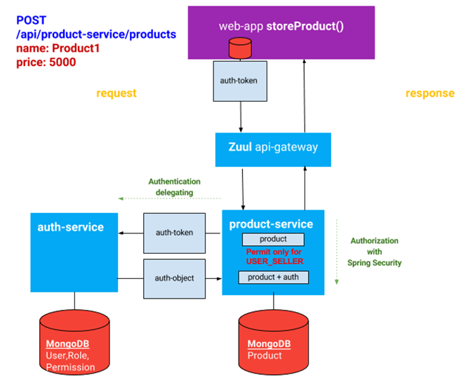

El product-service no conoce a los usuarios por lo que tiene que invocar al auth-service el cual desencripta el
token y lo valida para que product-service pueda continuar con su servicio.

### Tolerancia a fallos

Netflix Hystrix es la implementación par la tolerancia a fallos y utiliza el patrón Circuit Breaker. Esto se puede monitorizar con el Hystrix Dashboard.


## Implementación de libería común common-lib

Existen dos implementaciones distintas dependiendo del gestor de base de datos utilizado, para el primer proyecto base-spring-boot-project el gestor utilizado es MongoDB en el segundo proyecto base-spring-boot-jpa-project se utiliza JPA y el gestor de bases de datos utilizados en el proyecto base es Postress.


Paquetes:

**async** - utilidades para la respuesta asincrona a peticiones estas son utilizadas principalmente en la respuesta que dan los controladores.

**cache** - utilidades para la gestión de cache primaria y secundaria se utiliza en los objetos dao.

**command** - patrón comander, utilizado para gestionar tareas asíncronas y programadas.

**controller** - clases abstractas para implementación de controladores asíncronos.

**dao** - clases abstractas para implementación del patrón dao y consulta de datos parametrizadas.

**event** - clases de gestión del bus de peticiones/eventos la implementación realizada para eventos síncronos es la de rabitmq, también se pueden usar registrar eventos asíncronos con una programación.

**model** - clases base para implementación de entidades estas serán cacheadas a través del identificador id.

**security** - clases de seguridad implementación de spring security y filtros de autenticación y validación de token.

**service** - clases abstractas para implementación de servicios.

**util** - clases para envio de emails y gestión de imágenes.

**websocket** - implementación de comunicación vía websocket para la comunicación de eventos.

## Dockerfiles

### Dockerfile con perfil de producción para auth service igual para el resto
```
FROM openjdk:8-jre-alpine
ENV APP_FILE auth-service-0.0.1-SNAPSHOT.jar
ENV APP_HOME /usr/apps
ENV PROFILE prod
EXPOSE 81
COPY target/$APP_FILE $APP_HOME/
WORKDIR $APP_HOME
ENTRYPOINT ["sh", "-c"]
CMD ["exec java -Djava.security.egd=file:/dev/./urandom -Dspring.profiles.active=$PROFILE -jar $APP_FILE"]
```

## Configuración Kubernetess

## Minikube

### Arrancar minikube

```
minikube start --vm-driver=none --apiserver-ips 127.0.0.1 --apiserver-name localhost --memory 4096m
```

### Comprobar que está funcionando coredns

```
kubectl -n kube-system get pods
```

### En caso de no estar funcionando

```
$ sudo firewall-cmd --permanent --zone=trusted --add-interface=docker0
$ sudo firewall-cmd --reload
$ sudo firewall-cmd --get-active-zones
$ sudo firewall-cmd --list-all --zone=trusted
$ sudo chown -R $USER $HOME/.kube $HOME/.minikube
$ minikube dashboard &
```

### Si tuviesemos que eliminar la configuracion para volverla a crear

```
minikube delete
rm -rf ~/.kube
rm -rf ~/.minikube
```

## Implementación del manifiesto deployment.yaml

### Discovery server (eureka)

```
apiVersion: v1
kind: ConfigMap
metadata:
  name: eureka-cm
data:
  # if you want to deploy n instances of eureka cluster,
  # you should set eureka_service_address: http://eureka-0.eureka:1111/eureka,...,http://eureka-(n-1).eureka:1111/eureka
  eureka_service_address: http://eureka-0.eureka:1111/eureka,http://eureka-1.eureka:1111/eureka,http://eureka-2.eureka:1111/eureka
---
apiVersion: v1
kind: Service
metadata:
  name: eureka-lb
  labels:
    app: eureka
spec:
  selector:
    app: eureka
  type: LoadBalancer
  ports:
    - port: 80
      targetPort: 1111
---
apiVersion: v1
kind: Service
metadata:
  name: eureka
  labels:
    app: eureka
spec:
  clusterIP: None
  ports:
    - port: 1111
      name: eureka
  selector:
    app: eureka
---
apiVersion: apps/v1
kind: StatefulSet
metadata:
  name: eureka
spec:
  serviceName: 'eureka'
  # n instances
  replicas: 3
  selector:
    matchLabels:
      app: eureka
  template:
    metadata:
      labels:
        app: eureka
    spec:
      containers:
        - name: eureka
          image: josecarloslopez/discovery-server:1.0
          imagePullPolicy: IfNotPresent
          ports:
            - containerPort: 1111
          resources:
            requests:
              memory: "1Gi"
              cpu: "500m"
            limits:
              memory: "1200Mi"
              cpu: "500m"
          env:
            - name: EUREKA_SERVER_ADDRESS
              valueFrom:
                configMapKeyRef:
                  name: eureka-cm
                  key: eureka_service_address
            - name: ENVIRONMENT
              value: "prod"
            - name: JVM_OPTS
              value: "-Xms1g -Xmx1g"
#          livenessProbe:
#            httpGet:
#              path: /
#              port: 1111
#            initialDelaySeconds: 30
#            periodSeconds: 10
#            timeoutSeconds: 5
#          readinessProbe:
#            httpGet:
#              path: /
#              port: 1111
#            initialDelaySeconds: 30
#            periodSeconds: 10
#            timeoutSeconds: 5
```

### Api-Gateway

```
kind: Service
apiVersion: v1
metadata:
  name: api-gateway
spec:
  selector:
    app: api-gateway
  type: LoadBalancer
  ports:
    - protocol: TCP
      # Which port on the node is the service available through?
      nodePort: 31234
      # Inside the cluster, what port does the service expose?
      port: 80
      # Which port do pods selected by this service expose?
      targetPort: 8080
      
---
apiVersion: apps/v1
kind: Deployment
metadata:
  name: api-gateway
  labels:
    app: api-gateway
spec:
  replicas: 2
  selector:
    matchLabels:
      app: api-gateway
  template:
    metadata:
      labels:
        app: api-gateway
    spec:
      containers:
        - name: api-gateway
          image: josecarloslopez/api-gateway:1.0
          imagePullPolicy: IfNotPresent
          ports:
            - containerPort: 8080
```

### Base de datos Mongo

```
apiVersion: v1
kind: ConfigMap
metadata:
  name: mongodb
data:
  database-name: microservices
---
apiVersion: v1
kind: Secret
metadata:
  name: mongodb
type: Opaque
data:  
  database-user: dGVzdAo=
  database-password: ZXhhbXBsZQo=
---
apiVersion: apps/v1
kind: Deployment
metadata:
  name: mongodb
  labels:
    app: mongodb
spec:
  replicas: 1
  selector:
    matchLabels:
      app: mongodb
  template:
    metadata:
      labels:
        app: mongodb
    spec:
      containers:
      - name: mongodb
        image: josecarloslopez/mongodb-microservicios:1.0
        imagePullPolicy: IfNotPresent
        ports:
        - containerPort: 27017
---
apiVersion: v1
kind: Service
metadata:
  name: mongodb
  labels:
    app: mongodb
spec:
  ports:
  - port: 27017
    protocol: TCP
  selector:
    app: mongodb    
```

### Base de datos Postgres

```
apiVersion: v1
kind: ConfigMap
metadata:
  name: postgres-user-configmap
  labels:
    app: user-postgres
data:
  POSTGRES_DB: user
  POSTGRES_USER: docker
---
apiVersion: v1
kind: Secret
metadata:
  name: postgres-user-secrets
data:
  POSTGRES_PASSWORD: root
stringData:
  POSTGRES_USER: docker
---
kind: PersistentVolume
apiVersion: v1
metadata:
  name: postgres-user-pv-volume
  labels:
    type: local
    app: user-postgres
spec:
  storageClassName: manual
  capacity:
    storage: 3Gi
  accessModes:
    - ReadWriteMany
  hostPath:
    path: /data/pgdata/user/
---
kind: PersistentVolumeClaim
apiVersion: v1
metadata:
  name: postgres-user-pv-claim
  labels:
    app: user-postgres
spec:
  storageClassName: manual
  accessModes:
    - ReadWriteMany
  resources:
    requests:
      storage: 2Gi
---
apiVersion: apps/v1
kind: Deployment
metadata:
  name: user-postgres
spec:
  selector:
    matchLabels:
      app: user-postgres
  replicas: 1
  template:
    metadata:
      labels:
        app: user-postgres
    spec:
      containers:
        - name: user-postgres
          image: postgres:10.4
          imagePullPolicy: "IfNotPresent"
          ports:
            - containerPort: 5432
          envFrom:
          - secretRef:
              name: postgres-user-secrets
          - configMapRef:
              name: postgres-user-configmap  
          volumeMounts:
            - mountPath: /var/lib/postgresql/data
              name: postgredb
      volumes:
        - name: postgredb
          persistentVolumeClaim:
            claimName: postgres-user-pv-claim
---
apiVersion: v1
kind: Service
metadata:
  name: user-postgres
  labels:
    app: user-postgres
spec:
  type: NodePort
  ports:
    - port: 5432
  selector:
    app: user-postgres
```

### Servicios de negocio (cambia la configuración relacionada con el servicio y la base de datos)

```
# This is the kubernetes file for the auth-service
# In the service section, as we want to keep this service accessible only inside the kubernetes cluster
# we have the option of using the NodePort, or ClusterIP. Remember that if you use LoadBalancer in a eks cluster
# a load balancer will be created in AWS, pointing to the node instances of the cluster, which means it will be externally reachable.

kind: Service
apiVersion: v1
metadata:
  name: auth-service
spec:
  selector:
    app: auth-service
  type: NodePort
  ports:
      # Which port on the node is the service available through?
    - nodePort: 30001
      # Inside the cluster, what port does the service expose?
      port: 80
      # Which port do pods selected by this service expose?
      targetPort: 81

#kind: Service
#apiVersion: v1
#metadata:
#  name: auth-service
#spec:
#  selector:
#    app: auth-service
#  type: ClusterIP
#  ports:
#      port: 80
#      targetPort: 81
---
apiVersion: apps/v1
kind: Deployment
metadata:
  name: auth-service
  labels:
    app: auth-service
spec:
  replicas: 1
  selector:
    matchLabels:
      app: auth-service
  template:
    metadata:
      labels:
        app: auth-service
    spec:
      containers:
        - name: auth-service
          image: josecarloslopez/auth-service:1.0
          imagePullPolicy: Always
          ports:
           - containerPort: 81
          env:
          - name: POSTGRES_DB
            valueFrom:
              configMapKeyRef:
                name: postgres-user-configmap
                key: POSTGRES_DB
          - name: POSTGRES_USER
            valueFrom:
              configMapKeyRef:
                name: postgres-user-configmap
                key: POSTGRES_USER
          - name: POSTGRES_PASSWORD
            valueFrom:
              secretKeyRef:
                name: postgres-user-secrets
                key: POSTGRES_PASSWORD
```


### Spring Boot Admin

La consola de Spring Boot Admin está configurada en el api-gateway:

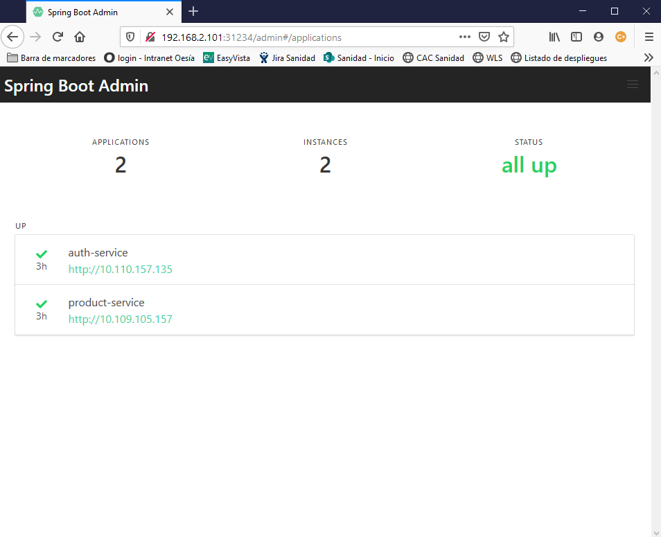

### Hystrix

Hystrix Dashboard está configurado en el api-gateway:

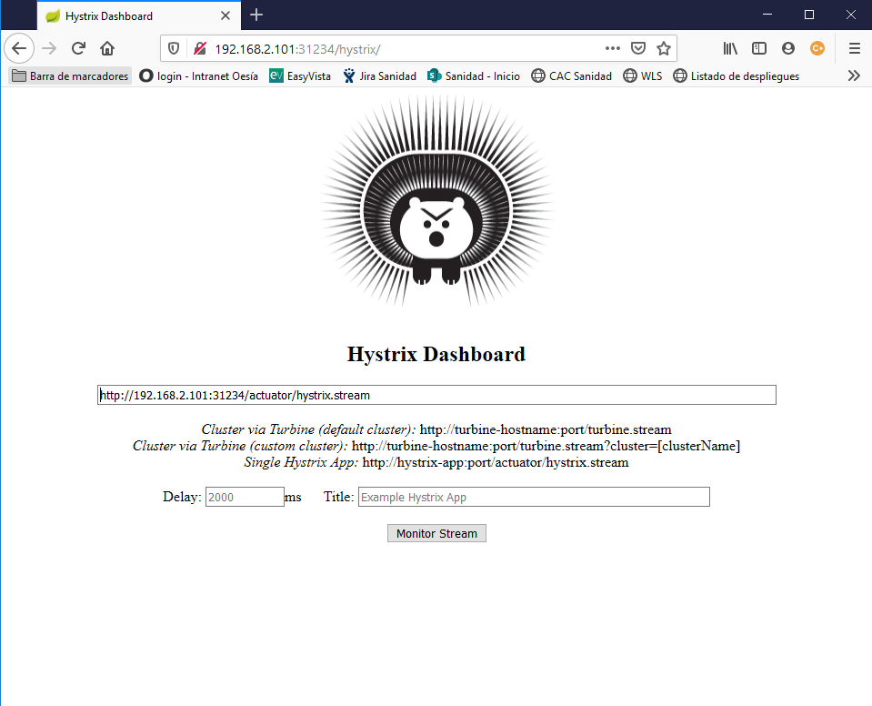

Si se incluye en stream: http://192.168.2.101:31234/actuator/hystrix.stream

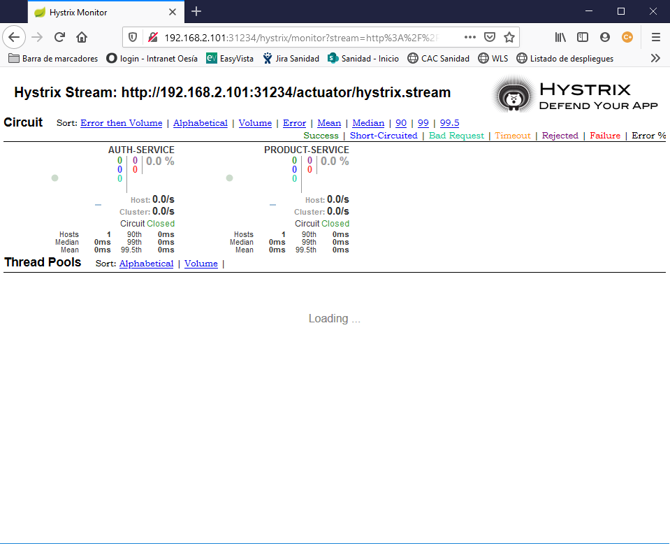

### Swagger

Swagger UI para mostrar las definiciones de los servicios está configurado en el api-gateway:

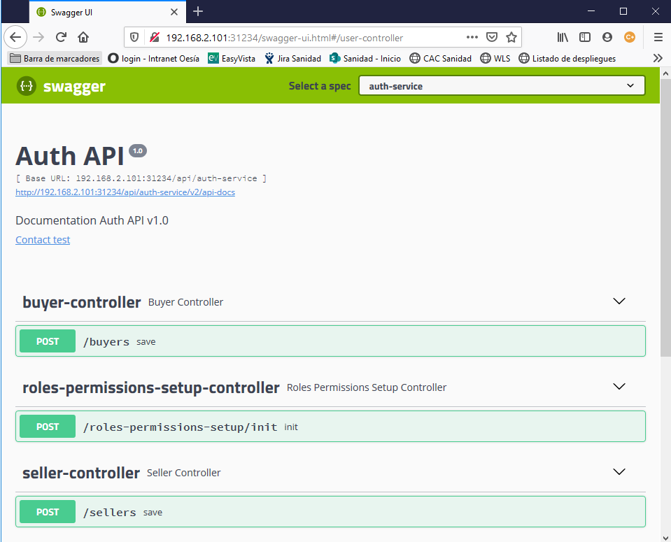


## Pruebas con Postman

### Solicitar token

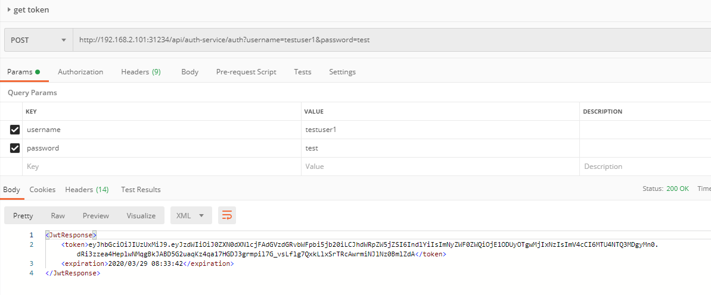

### Añadir producto

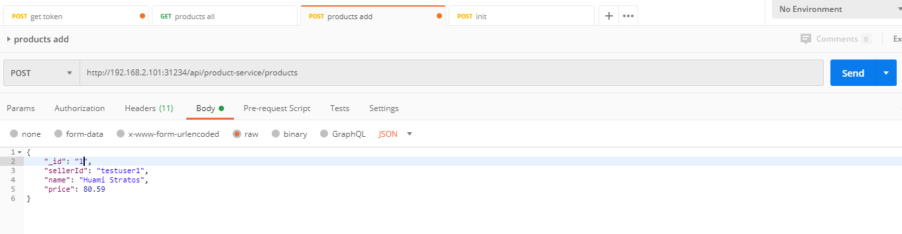
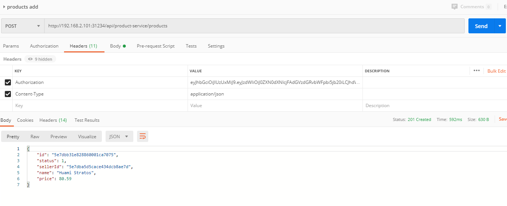

### Ver productos

