# Microservicios

## Implementación Netflix Stack

## Introducción al proyecto de ejemplo

En los primeros pasos explicamos la arquitectura a alto nivel para tener una idea de como funciona. Este es
solo una aplicación de ejemplo.

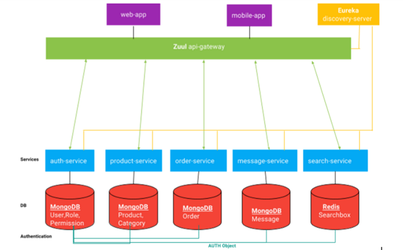

### Core Services

Acorde a una arquitectura microservicios dividimos la aplicación en servicios separados. Cada servicio es escalable e 
independiente con un ambito bien definido. Estos son construidos como proyectos SpringBoot:

- **auth-service** responsable de la gestión del proceso de autenticación utilizando una base de datos Mongo con usuarios
roles y permisos.
- **product-service** responsable del almacenamiento de los productos y gestión de inventario.

Los servicios con los que funciona la arquitectura Netflix son los siguientes:

- **discovery-server** es quien descubre los servicios que requerimos, cuando algun servicio necesita acceso a otro
servicio, discover server provee los detalles de los end points *Instance-Id = {Server-Host} + ':' {Service-Id} + ':' + {Server-Port})* 
Por otro lado discovery server no conoce nada mas sobre el servicio. Hay varias implementaciones para crear un discovery server 
(Netflix Eurea, Consul, Zookeeper) la arquitectura netflix utiliza Eureka.

Los clientes del discovery server son los discovery client cada uno esta etiquetado con *@EnableDiscoveryClient* o 
*@EnableEurekaClient*. En la configuración de cada uno de los clientes se utiliza la *defaultZone* para definir
la localización del discovery server. Con *leaseRenewallIntervalInSeconds* se puede configurar el tiempo de regisro.
El tiempo de registro toma mas de 30 segundos que es el tiempo de refresco por defecto.

*Balanceador de carga* Eureka provee los endpoints para las peticiones, pero es el balanceador de carga quien decide
a que endpoint establece la conexión. Según el agoritmo del balanceador de carga *Cliend-Side-Load-Balancer*  puede 
seleccionar el mejor endpoint de la lista para establecer la conexión. En nuestro caso se utiliza *Netflix Ribbon*
como balanceador de carga.

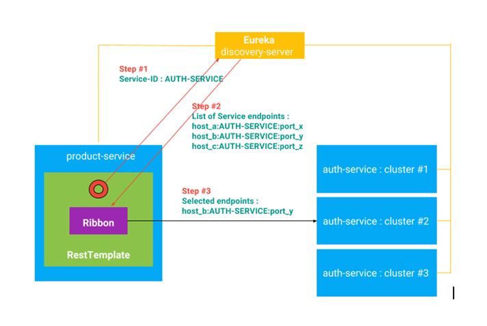

Dedendiendo de nuestras necesidades podremos cambiar al mejor algoritmo de balanceo de carga. En Ribbon hay varias
implementaciones: Simple Round Robin LB, Weighted Response Time LB, Zone Aware, Round Robin LB, Random LB.
Incluso se puede implementar un propio LB por defecto se utiliza Simple Round Robin.

En las clases de configuración AppConfiguration, se configuran los bean de acceso RestTemplate dentro del contexto
Spring. La anotación *@LoadBalancer * ayuda a configurar Ribbon dentro del RestTemplate.

```
	@LoadBalanced
	@Bean
	public RestTemplate restTemplate() {
		return new RestTemplate();
	}
```

RestTemplate para acceso al servicio de configuración implementado en CommonAuthenticationTokenFilter.java

```
ResponseEntity<String> responseEntity = restTemplate.exchange(
						"http://auth-service/auth/current"
						, HttpMethod.POST
						, entity
						, String.class);
```

- **api-gateway** Es la puerta de entrada al sistema indica como los usuarios externos como aplicaciones
móviles o web tienen acceso a nuestro servicio o en otras palabras expone los servicios a usuarios externos.

Aquí se utiliza dentro de la arquitectura Netflix el Zuul API Gateway (Zuul es el guardián de la puerta de GhostBusters)

Zuul se puede utilizar como un proxy y un filtro de peticiones.

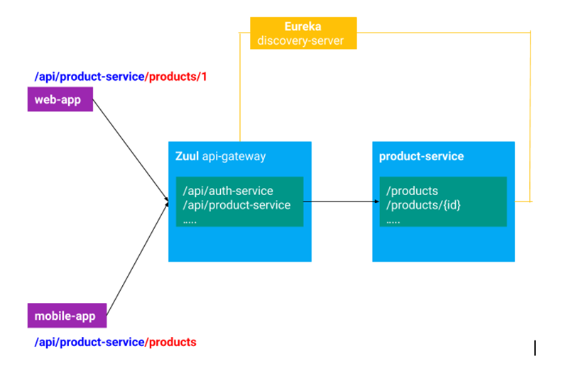

*Gestión de la seguridad* para esto principalmente se utiliza JWT (JSON Web Token) y Spring Security:

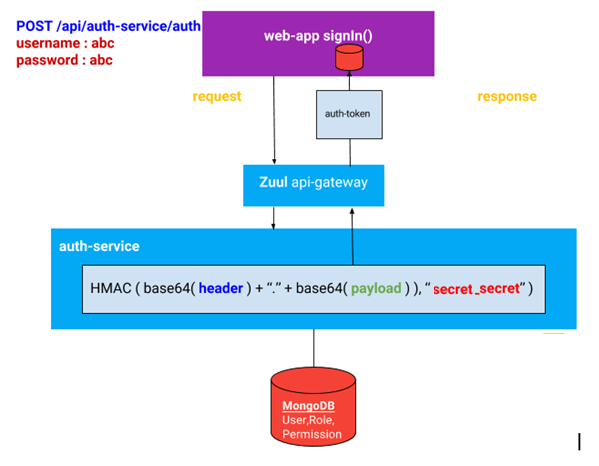

En las configuraciones de JWT para los servicios se encuentra esta entrada:
```
# Auth JWT
jwt:
  header: Authorization
  secret: secret_secret
  expiration: 172800 #seconds
  route:
    authentication:
      path: auth-service
      refresh: refresh
```
La aplicación de esto para la creación del token es la siguiente:
```
header = {"alg": "HS256", "typ": "JWT"}
payload = {
              "exp": "2017-08-09 12:00:00",
              "user_name": "user",
              "authorities": [
                   "ROLE_SELLER"
               ],
               ...
              }
secret_key = "secret_secret"
Token = HMAC( base64(header) + "." + base64(payload) , secret_key)
```

Las peticiones deberán llevar en la cabecera la entrada Authorization, que será el auth-token. Las aplicaciones
deberán manteneer el token generado para el envío en cada una de las peticiones que se realicen.

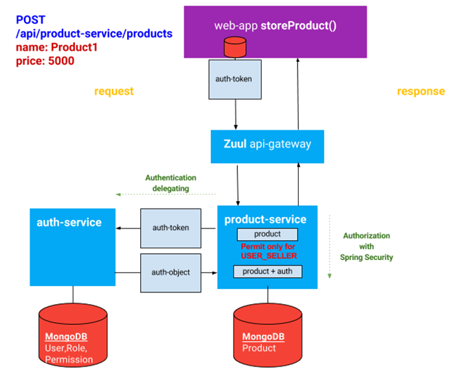

El product-service no conoce a los usuarios por lo que tiene que invocar al auth-service el cual desencripta el
token y lo valida para que product-service pueda continuar con su servicio.

### Tolerancia a fallos

Netflix Hystrix es la implementación par la tolerancia a fallos y utiliza el patrón Circuit Breaker.

### Ejecución del proyecto

Arrancar mongodb y crear la base de datos, insertar el primer usuario para pruebas:
```
C:\mongodb\bin>mongo
MongoDB shell version: 2.6.11
connecting to: test
> use microservices
switched to db microservices
> show collections
> db.User.insert({ "username" : "testuser1", "password": "$2a$10$MK2.vNiBHToVNwqJl9P2luHjbTMUkNi.fxKJ0b/u/dEFJY0taGjm6", "email" : "testuser1@testdomain.com", "permissions" : [{"code" : "USER_ADMIN"},{"code" : "USER_SELLER"}] })
WriteResult({ "nInserted" : 1 })
```
Instalación de common-lib
```
go inside to the common-lib project folder
then run mvn clean install
```
run discovery-server
```
go inside to the discovery-server project folder
then run mvn clean package
then run java -jar target\discovery-server-0.0.1-SNAPSHOT.jar
```
run api-gateway
```
go inside to the api-gateway project folder
then run mvn clean package
then run java -jar target\api-gateway-0.0.1-SNAPSHOT.jar
```
run auth-service
```
go inside to the auth-service project folder
then run mvn clean package
then run java -jar target\auth-service-0.0.1-SNAPSHOT.jar
```
auth-service init
make request for the auth-service for setup roles and permissions.
POST /api/auth-service/roles-permissions-setup/init

run product-service
```
go inside to the product-service project folder
then run mvn clean package
then run java -jar target\product-service-0.0.1-SNAPSHOT.jar
```

## Configuración Kubernetess

### Minikube
Arrancar minikube
---
```
minikube start --vm-driver=none --apiserver-ips 127.0.0.1 --apiserver-name localhost
```
Comprobar que está funcionando coredns
---
```
kubectl -n kube-system get pods
```
En caso de no estar funcionando
---
```
$ sudo firewall-cmd --permanent --zone=trusted --add-interface=docker0
$ sudo firewall-cmd --reload
$ sudo firewall-cmd --get-active-zones
$ sudo firewall-cmd --list-all --zone=trusted
$ sudo chown -R $USER $HOME/.kube $HOME/.minikube
$ minikube dashboard &
```
Si tuviesemos que eliminar la configuracion para volverla a crear
---
```
minikube delete
rm -rf ~/.minikube
```

### Dockerfiles

Dockerfile para auth service crear también para product service
---
```
FROM openjdk:8-jre-alpine
ENV APP_FILE auth-service-0.0.1-SNAPSHOT.jar
ENV APP_HOME /usr/apps
ENV PROFILE prod
EXPOSE 81
COPY target/$APP_FILE $APP_HOME/
WORKDIR $APP_HOME
ENTRYPOINT ["sh", "-c"]
CMD ["exec java -Djava.security.egd=file:/dev/./urandom -Dspring.profiles.active=$PROFILE -jar $APP_FILE"]
```

### Construir las imágenes, subirlas si se quieren tener en repositorio y desplegar con Kubernetess
```
$ cd discovery-server
$ docker build -t josecarloslopez/discovery-server:1.0 -f Dockerfile .
$ docker push josecarloslopez/discovery-server:1.0
$ kubectl apply -f deployment.yaml
$ cd ..
$ cd api-gateway
$ docker build -t josecarloslopez/api-gateway:1.0 -f Dockerfile .
$ docker push josecarloslopez/api-gateway:1.0
$ kubectl apply -f deployment.yaml
$ cd ..
$ cd auth-service
$ docker build -t josecarloslopez/auth-service:1.0 -f Dockerfile .
$ docker push josecarloslopez/auth-service:1.0
$ kubectl apply -f deployment.yaml
$ cd mongo
$ docker build -t josecarloslopez/mongodb-microservicios:1.0 -f Dockerfile .
$ kubectl apply -f deployment.yaml
$ cd ..
$ cd ..
$ cd product-service
$ docker build -t josecarloslopez/product-service:1.0 -f Dockerfile .
$ docker push josecarloslopez/product-service:1.0
$ kubectl apply -f deployment.yaml
```

### Para kubernetes crear usuario en mongodb

```
kubectl -ti exec mongodb-5558574d46-jp2fz sh
$ mongo
> use admin
switched to db admin
> db.auth("root", "example")
> show databases
admin          0.000GB
config         0.000GB
local          0.000GB
microservices  0.000GB
> use microservices
switched to db microservices
> db.User.insert({ "username" : "testuser1", "password": "$2a$10$MK2.vNiBHToVNwqJl9P2luHjbTMUkNi.fxKJ0b/u/dEFJY0taGjm6", "email" : "testuser1@testdomain.com", "permissions" : [{"code" : "USER_ADMIN"},{"code" : "USER_SELLER"}] })
WriteResult({ "nInserted" : 1 })
> show collections
Permission
Role
User
```

## Spring Boot Admin

La consola de Spring Boot Admin está configurada en el api-gateway:

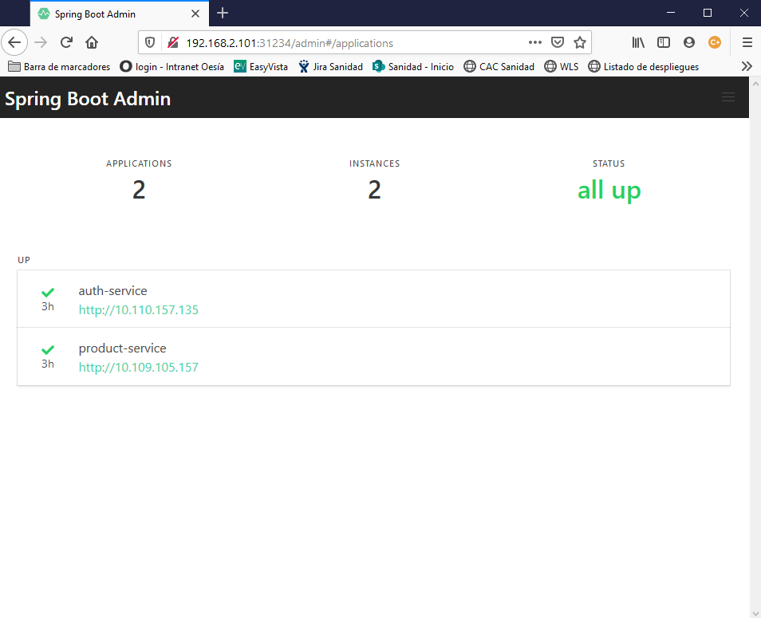

## Hystrix

Hystrix Dashboard está configurado en el api-gateway:

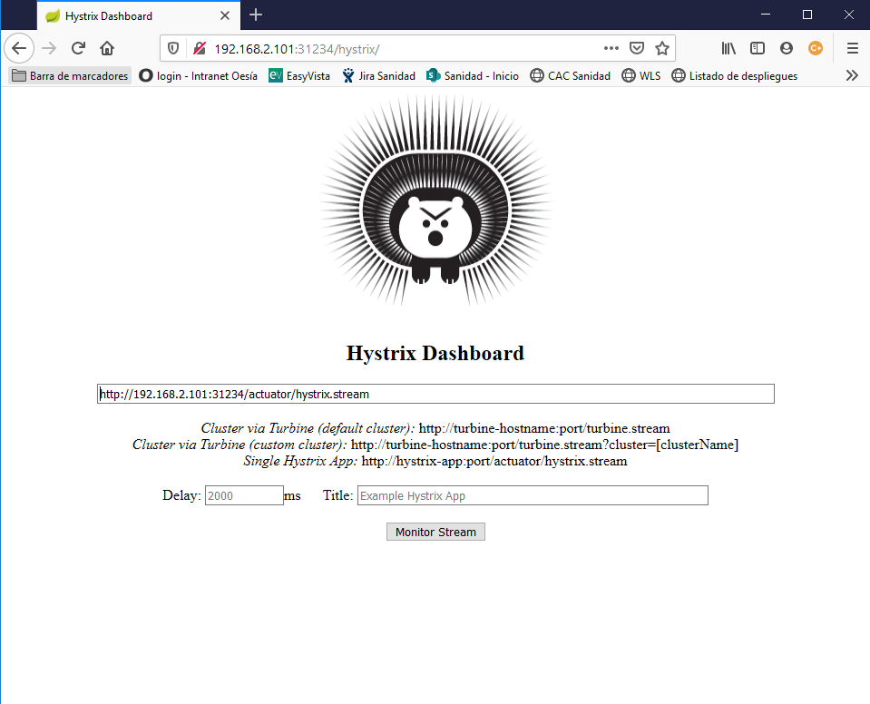

Si se incluye en stream: http://192.168.2.101:31234/actuator/hystrix.stream

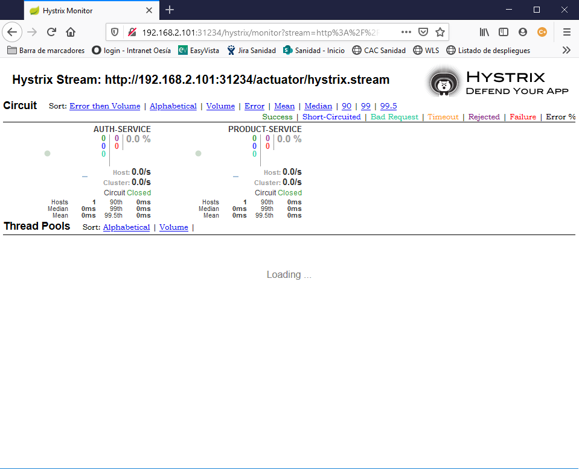

## Swagger

Swagger UI para mostrar las definiciones de los servicios está configurado en el api-gateway:

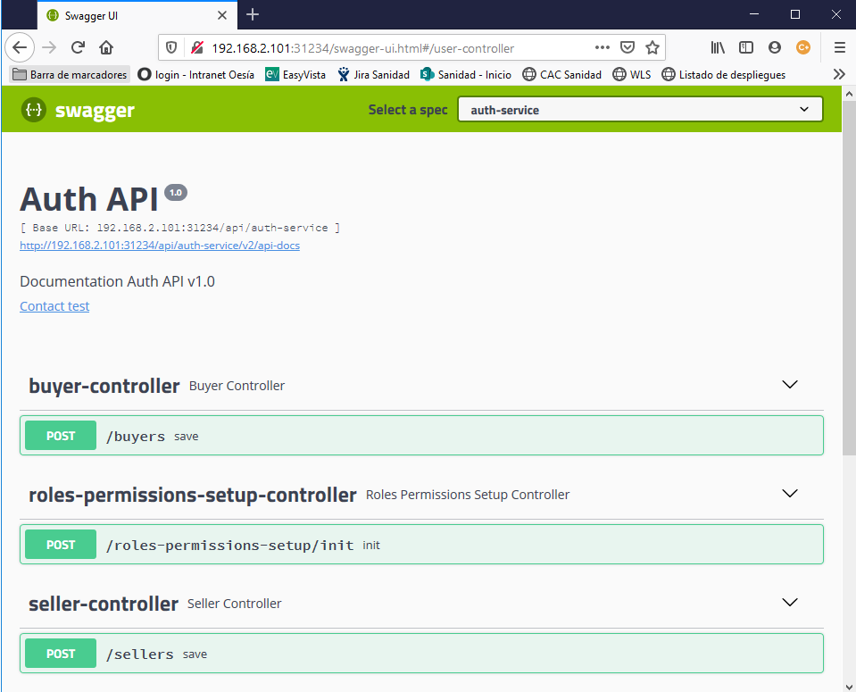


## Pruebas con Postman

### Solicitar token

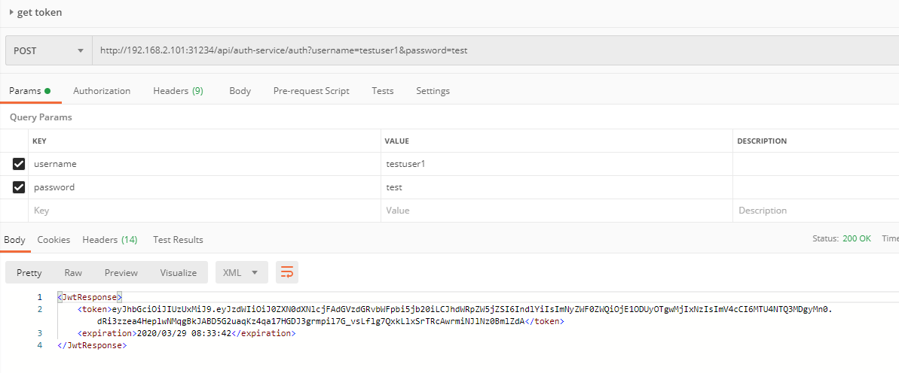

### Añadir producto

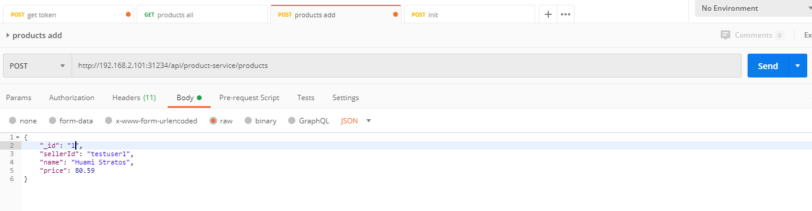
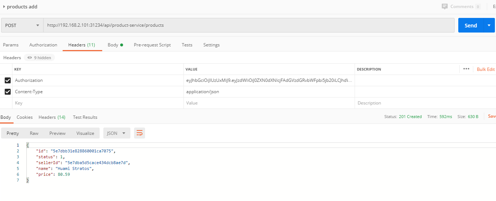

### Ver productos

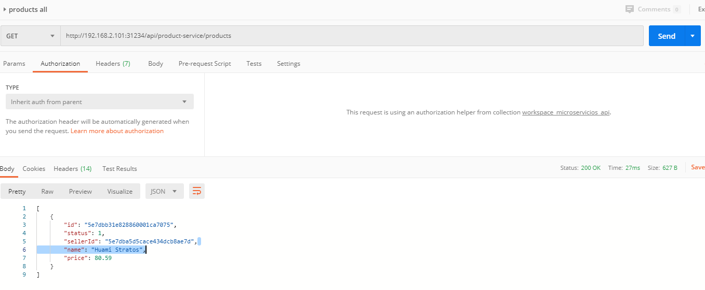